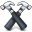

#  Hammer Tags

***

## Clever Paths

Hammer knows about all the files in your project, and is intelligent about handling file paths. Instead of writing an absolute or relative link to your file, you can just use the file name itself and Hammer will find it and use it.

In Hammer, you can just write this:

	" />

or:

	

In your CSS you could specify that image as a background image the same way:

	background-image: url(mac.png)

or:

	background-image: url(../assets/photos/mac.png)

When Hammer compiles your Build folder it will substitute these URLs for relative URLs so that no matter where your build is viewed, the file paths will be correct.

You can even move your images and files around - Hammer will always get the right paths every time it builds, as long as your file names remain the same.

***

> © 2013 Riot Ltd. All Rights Reserved - [Menu](index.md "Main menu")