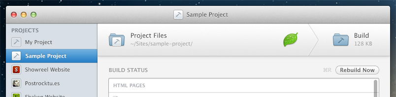
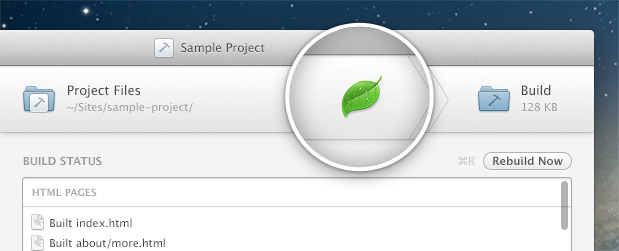
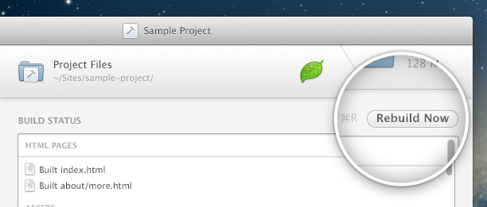

#  Editing & Building

***

## Editing your project files

At the top of the project view you will see your Project Files folder shown on the left, and the Build folder Hammer creates for it on the right.

You can open the Project Files folder by clicking on it or choosing Open Project Files Folder from the Project menu (`⌘⇧P`). The Build folder can be opened by choosing Open Build Folder (`⌘⇧B`). You can also reveal their location in the Finder by clicking the reveal icons next to them.

Remember, you should only ever edit files in your Project Files folder. The Build folder will always be overwritten by the changes you make in the Project Files folder.

***

## Setting and using a text editor

Hammer can launch your Project Files folder in a text editor of your choosing, making it convenient to manage your project from Hammer.

The first time Hammer is launched you can choose which editor Hammer should use, by left or right clicking on the Application placeholder icon. A contextual menu will show preferred editors that you have installed on your Mac, while you can choose any editor you like by choosing Other…

When you select a text editor, the placeholder icon will change to show your chosen Application’s icon. Left clicking this icon will launch your Project Files folder in that Application, while right clicking will allow you to choose a different editor. These options are also available in the Project menu.

Your editor choice is set as the editor across all of your Hammer projects.

***

## Build your project

In the main project view, the Build status section show the current status of your build.

Every time Hammer performs a build it will show the output of the build in the status box and a message to indicate whether the build was successful or whether something was wrong and it failed. If a build fails the output should show what went wrong so you can correct it.

While Hammer will automatically build every time a file changes, you can perform a manual build by choosing Rebuild (`⌘R`) from the Project menu or hitting the Rebuild button.

***

> © 2013 Riot Ltd. All Rights Reserved - [Menu](index.md "Main menu")