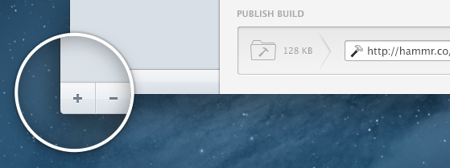

#  Getting Started

***

## What is Hammer?

Hammer is a web development tool that lets front-end developers write HTML, CSS & JS web builds more efficiently and quickly, and makes them easier to maintain, especially across larger builds that change frequently during development.

## How does Hammer work?

When you create or add a project to Hammer, it will create a ‘Build’ folder inside your project folder.

You edit your HTML, CSS & JS files in your text editor of choice and every time a file is updated, added or removed, Hammer will automatically update the Build folder to reflect the changes.

You can do lots of clever things inside your project that you couldn’t do before, and Hammer will always compile to straight HTML, CSS & JS in your Build folder.

***

## Create your project

1. _Choose Create New Project (**⌘N**) from the File menu or hit the + button at the bottom of the source list._
2. _Choose a location to create the project in the Save dialog._
3. _By default Hammer will create your project with a standard set of files to get you started. If you wish to create a blank project instead you can deselect this option._

***

## Add an existing project

1. _Choose Add Existing Project (**⌘⇧N**) from the File menu and select the folder in the Open dialog._
2. _You can give the project a name in the Open dialog, or Hammer will take the name of the folder by default._
3. _You can also drag and drop a folder from the Finder into the Hammer source list._

***

> © 2013 Riot Ltd. All Rights Reserved - [Menu](index.md "Main menu")

