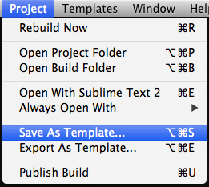
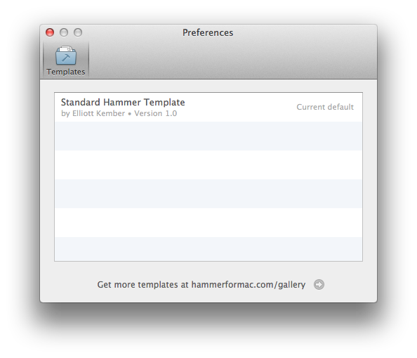

#  Hammer Templates

***

## Creating your own Hammer Templates

Many web designers and developers have site templates - re-usable boilerplate code for starting new projects. With Hammer Templates, it's easy to create and re-use standard markup and libraries with every new project.

## Creating a Hammer Template

To create a Hammer Template, just choose a project, then in the Project menu, choose "_Save As Template_".

This creates a Hammer Template, and saves it to Hammer. To see a list of your templates, just click "_Manage Templates_" in the Templates menu.

## Exporting Hammer Templates

You can also export a Hammer Template. This saves the template out as a .hammer file, for easy sharing or publishing.

In fact, a _.hammer_ file is really just a .zip archive of your project with a special extension and icon.

## The Template Gallery

We're compiling a set of the coolest Hammer templates to feature on the **[Gallery page](http://hammerformac.com/gallery.html "Hammer's templates page")**. If you have a cool template you'd love to see featured, please **[email us](support@hammerformac.com "Hammer - Contact us")** - we'd love to see what you're working on!

***

> © 2013 Riot Ltd. All Rights Reserved - [Menu](index.md "Main menu")