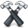

#  Optimized Mode

***

## Optimizing your project

When you're ready to publish your site, Hammer has a built-in feature for compressing and minimizing your code. Simply turn on the "Optimized" switch, and Hammer takes care of the rest.

Whenever you use a `@stylesheet` or `@javascript` tag to reference multiple files, Hammer finds those files and compresses them into one file in the root of your project after compiling them. This means that instead of linking to 5 Javascript files, your build only references one - dramatically reducing the amount of bandwidth overhead your site uses.

	<!-- @stylesheet reset normalize buttons style -->

&nbsp;

	<link rel="stylesheet" type="text/css" href="../9bc29a8e2b69829b8e9b8.css">

Hammer gives compressed files a unique name - an MD5 hash of their contents. That means any time you change your assets, Hammer creates a new name for the generated file - perfect for automatically busting browser caches.

## Notes about Optimized mode

• Hammer's `<!-- @reload -->` tag doesn't work in Optimized mode. That's because Hammer adds code to your site in normal development mode, and we don't want that code going onto the server.

• Optimized mode takes longer to compile. It's doing quite a bit more work to compress your site down, which takes a while. But it's worth it! Your site will load much faster in Optimized mode.

• Finally: When you're deploying your site, remember to build the site in "Optimized" mode before you publish it or export it.

***

> © 2013 Riot Ltd. All Rights Reserved - [Menu](index.md "Main menu")