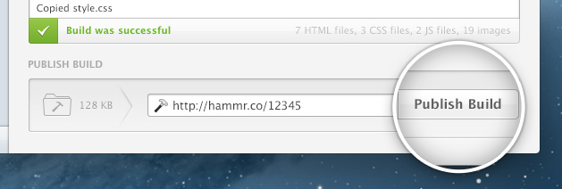
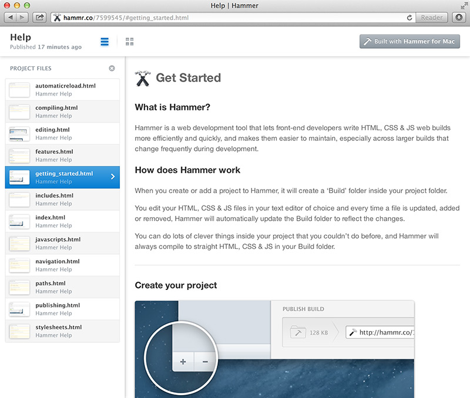

#  Publishing

***

## Sharing Builds

If you’re creating websites for your clients, you’ll know that they like to see updates and they like to see them often. They also like to be able to browse through them easily and keep track of progress.

Hammer features a great, free one-click publishing service called Hammr.co - and lets you publish your build to the web, for sharing and previewing.

***

## Publish to Hammr.co

1. When you’re ready to publish a version of your build, hit the Publish button at the bottom of the project view.
2. Once Hammer has completed uploading the build files, it returns a short URL which you can share with others.
3. Every time you publish your build, you’ll get a different short URL to use.

When you visit the short URL in a browser you’ll see your build’s index.html page. Clicking through any live links will link to the correct places and update the page.

To see a list of the pages in your project you can click the ‘List’ icon - this will expand a sidebar that shows all the HTML pages in your build. Clicking through the links in this menu will show that page on the right and highlight the active page in this menu.

To get a quick graphical overview of the pages in your project you can click the ‘Modal’ button which will temporarily show screenshots and titles for all the HTML pages in your build. Clicking one of these links will load the page and hide this modal view.

To view the published build without the header bar you can hit the close button which will open the URL without the bar.

***

## How does it work?

Hammr.co is an anonymous, free service. Your sites are disallowed from being crawled via our robots.txt settings - but your sites are still visible to the web.

Your site will stay published for three weeks after you publish it. If you do need a published build deleted before that, **[email us](support@hammerformac.com "Email us")** and we'll be happy to take it down.

If you require security for your previews for NDA or legal reasons, we would suggest that you use a traditional FTP server. That keeps Hammr.co simple and easy to use, and perfect for everyday use!

***

> © 2013 Riot Ltd. All Rights Reserved - [Menu](index.md "Main menu")