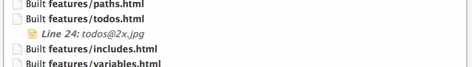

#  Hammer Tags

***

## Todos `New in 1.3`

Where you have unfinished or temporary code, you can leave yourself a todo inline. Hammer keeps track of all your `@todo` tags and displays them in the build output right inside the app.

	<!-- @todo Fix the navigation -->

&nbsp;

	/* @todo Fix this CSS */

&nbsp;

	// @todo Fix this Javascript

Hammer looks for these tags in your HTML, CSS and Javascript, and shows them in the main window.

This is a great way of keeping track of all your unfinished work and makes sure you never leave one behind.

***

> © 2013 Riot Ltd. All Rights Reserved - [Menu](index.md "Main menu")